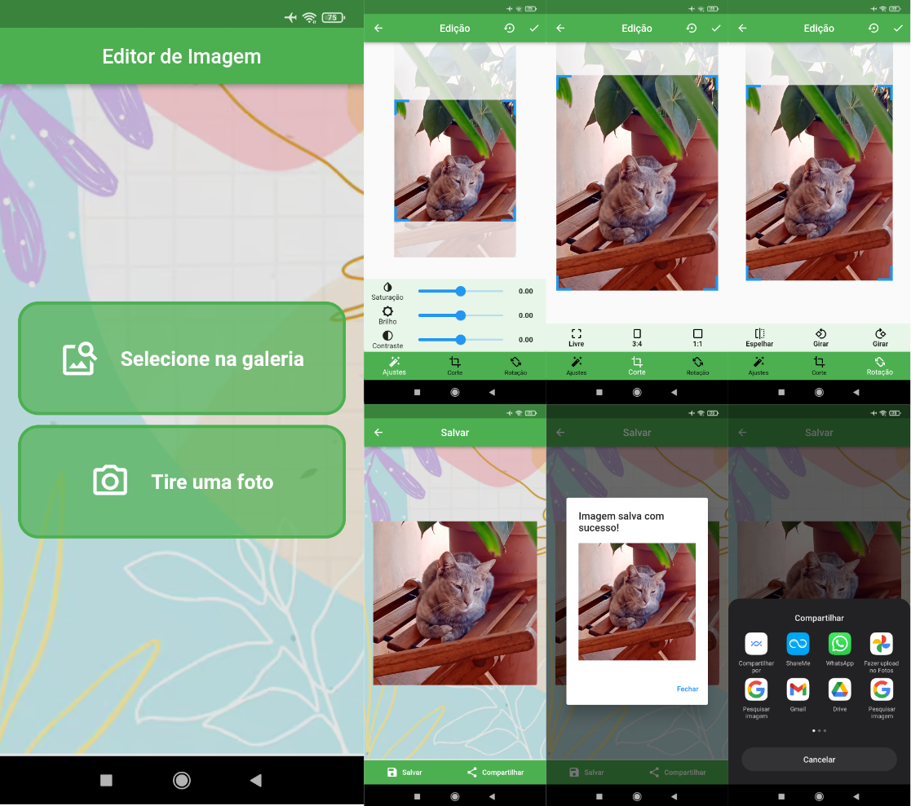

# Editor de Imagem

O aplicativo possui três telas principais
- Seleçao de imagem
- Edição de imagem
- Compartilhamento

## Seleção de imagem

Contém botões para seleção de imagem, a partir da galeria do dispositivo ou a partir de uma fotografia realizada com a câmera do dispositivo

## Edição de imagem

Na pagina de edição, há uma barra de navegação, com os itens: 
- Edição de caracteristicas: Acessa o campo para alteração do brilho, saturação e contraste.
- Corte: Acessa o campo para realização de cortes, dispondo de três possibilidades, livre, 3:4, 1:1.
- Posição: Acessa o campo para rotação para direita, esquerda e espelhamento da imagem.

A appbar desta página contem um botão de retorno à página de seleção de imagem, o nome da página, um botão para voltar a imagem às suas caracterisiticas iniciais e um para confirmar as edições e acessar a pàgina de compartilhamento

## Compartilhamento

A página de compartilhamento apresenta duas possibilidades, compartilhar a imagem editada e salvar na galeria do dispositivo.

A appbar desta página contem um botão de retorno à página de edição de imagem e nome da página.
