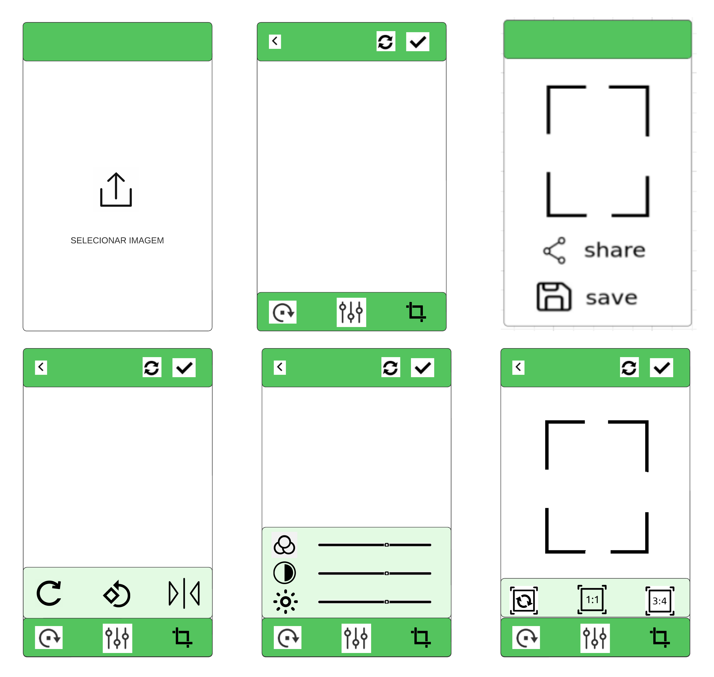

# image-editor-flutter

O aplicativo tera que ter tres telas principais
- home
- edição de imagem
- compartilhamento

## home

na pagina home deve-se ter um campo para seleção e apresentação da imagem selecionada da galeria.
a app bar somente precisa ter o nome do aplicativo

## edição de imagem

na pagina de edição, deve-se ter uma barra de navegação, com os itens: 
- rotação+espelhamento: icone que abrira um menu com possibilidade de rotação para direita, esquerda e espelhamento da imagem
- edição de caracteristicas: icone que abrira um menu com possibilidade de alteração do brilho, saturação e contraste
- corte: icone que abrirá um menu com tres possibilidades, (3:4), (1:1) e original (deverá retornar as medidas originais da foto)

deve haver uma app bar com 4 itens, um para retornar para a pagina home, o nome da pagina, um para voltar a imagem para suas caracterisiticas iniciais e uma para confirmar as edições e que leva para pagina de compartilhamento

## compartilhamento

na pagina de compartilhamento deverá haver dois campos, um para compartilhar a foto editada e um para salvar na galeria

deve haver uma app bar com 2 itens, um para voltar para a pagina de edição e um com o nome da pagina (comparilhamento)
